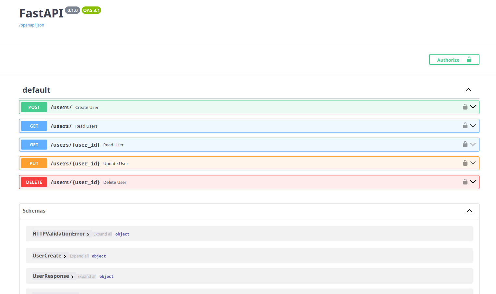

# Vibe Coder Agent

An AI-powered code generation tool that creates Python applications and HTML websites with minimal coding knowledge required. Leverages multiple LLM providers to assist in generating, managing, and executing projects through an interactive CLI interface.

## Overview

The Vibe Coder Agent is designed for users who want to create projects with minimal or no coding experience. It uses artificial intelligence to automatically generate code, manage project environments, and handle dependency installation. The tool supports creating Streamlit applications, FastAPI services, and static HTML websites through conversational AI-driven requirements gathering.

## Features

- **🚀 No-Code Project Creation**: Generate complete applications without extensive coding knowledge
- **🤖 AI-Powered Requirements Gathering**: Interactive conversation to understand your project needs
- **📁 Environment Management**: Create project-specific environments with timestamped directories
- **⚡ Automatic Code Generation**: Generate complete applications based on user requirements
- **🔄 Project Analysis & Updates**: Analyze existing projects and suggest improvements
- **🌐 Multi-Platform Support**: Create Streamlit apps, FastAPI services, and HTML websites
- **🔧 Multiple LLM Support**: Compatible with OpenAI, DeepSeek, Local LLM, and Ollama
- **📦 Dependency Management**: Automatic installation and management of project dependencies
- **🏃 Application Execution**: Built-in support for running and testing generated applications

## Installation

### Prerequisites

- Python 3.8 or higher
- Git (for cloning the repository)
- API access to at least one supported LLM provider

### Setup Instructions

1. **Clone the Repository**
   ```bash
   git clone https://github.com/your-username/vibe_coder.git
   cd vibe_coder
   ```

2. **Install Dependencies**
   ```bash
   pip install -r requirements.txt
   ```

3. **Configure Environment Variables**
   ```bash
   cp .envcopy .env
   ```
   
   Edit the `.env` file with your API keys and configuration:
   ```bash
   nano .env  # or use your preferred editor
   ```

4. **Update LLM Client Configuration**
   
   The `openai_client.py` file handles LLM provider connections. For most providers, you only need to update the `.env` file, but for custom setups, you may need to modify this file:
   
   ```python
   # openai_client.py - Default configuration
   from openai import OpenAI
   import os
   from dotenv import load_dotenv
   
   load_dotenv()
   
   def get_client():
       client = OpenAI(
           api_key=os.getenv("OPENAI_API_KEY"), 
           base_url=os.getenv("BASE_URL_OPENAI")
       )
       return client
   ```
   
   For different providers, update the environment variables in `.env` accordingly.

5. **Verify Installation**
   
   Test your setup by running:
   ```bash
   python latest_coding_agent.py
   ```
   
   You should see the main menu with three options. If you encounter errors, check the troubleshooting section below.

### Complete Setup Example (OpenAI)

Here's a complete setup example using OpenAI:

```bash
# 1. Clone and navigate
git clone https://github.com/your-username/vibe_coder.git
cd vibe_coder

# 2. Install dependencies
pip install -r requirements.txt

# 3. Setup environment
cp .envcopy .env

# 4. Edit .env file (replace with your actual API key)
echo 'OPENAI_API_KEY=sk-proj-your-actual-openai-key-here' > .env
echo 'BASE_URL_OPENAI=https://api.openai.com/v1/' >> .env
echo 'MODEL_NAME=gpt-3.5-turbo' >> .env

# 5. Test the setup
python latest_coding_agent.py
```

### Virtual Environment Setup (Recommended)

For better dependency management, use a virtual environment:

```bash
# Create virtual environment
python -m venv vibe_coder_env

# Activate virtual environment
# On Windows:
vibe_coder_env\Scripts\activate
# On macOS/Linux:
source vibe_coder_env/bin/activate

# Install dependencies
pip install -r requirements.txt

# Continue with setup...
```

## Configuration

### Environment Variables

The application uses the following environment variables (defined in `.env`):

```bash
# OpenAI Configuration
OPENAI_API_KEY=sk-proj-your-api-key-here
BASE_URL_OPENAI=https://api.openai.com/v1/

# DeepSeek Configuration  
BASE_URL_DEEPSEEK=https://api.deepseek.com/v1/

# Local LLM Configuration
LOCAL_URL=http://127.0.0.1:1234
LOCAL_API_KEY=your-local-api-key

# Model Configuration
MODEL_NAME=qwen2.5-coder-3b-instruct
```

### Supported LLM Providers

#### OpenAI Configuration
- **Models**: GPT-3.5, GPT-4, and other OpenAI models
- **Setup**: 
  1. Get API key from [OpenAI Platform](https://platform.openai.com/api-keys)
  2. Set in `.env`: `OPENAI_API_KEY=sk-proj-your-actual-key`
  3. Set base URL: `BASE_URL_OPENAI=https://api.openai.com/v1/`
  4. Choose model: `MODEL_NAME=gpt-3.5-turbo` or `gpt-4`

#### DeepSeek Configuration
- **Models**: DeepSeek Coder and Chat models
- **Setup**:
  1. Get API key from [DeepSeek Platform](https://platform.deepseek.com/)
  2. Set in `.env`: `OPENAI_API_KEY=your-deepseek-key`
  3. Set base URL: `BASE_URL_OPENAI=https://api.deepseek.com/v1/`
  4. Choose model: `MODEL_NAME=deepseek-coder` or `deepseek-chat`

#### Local LLM Configuration
- **Models**: Self-hosted models via local API servers (LM Studio, text-generation-webui, etc.)
- **Setup**:
  1. Start your local LLM server (e.g., LM Studio on port 1234)
  2. Set in `.env`: `OPENAI_API_KEY=not-needed` (or any placeholder)
  3. Set base URL: `BASE_URL_OPENAI=http://127.0.0.1:1234/v1/`
  4. Set model name: `MODEL_NAME=your-local-model-name`

#### Ollama Configuration
- **Models**: Local Ollama installations
- **Setup**:
  1. Install and start Ollama locally
  2. Pull desired model: `ollama pull qwen2.5-coder:3b`
  3. Set in `.env`: `OPENAI_API_KEY=ollama` (placeholder)
  4. Set base URL: `BASE_URL_OPENAI=http://localhost:11434/v1/`
  5. Set model: `MODEL_NAME=qwen2.5-coder:3b`

## Usage

### Quick Start

Run the application:
```bash
python latest_coding_agent.py
```

### Main Options

The application provides three main options:

1. **Create a new Python application** - Generate Streamlit apps or FastAPI services
2. **Update an existing generated project** - Modify and enhance previously created projects  
3. **Create a static HTML website** - Generate complete HTML/CSS/JavaScript websites

### Example Workflow

```
================================================================================
Python Application Generator
================================================================================
Options:
1. Create a new Python application
2. Update an existing generated project
3. Create a static HTML website

Enter your choice (1, 2 or 3): 1
What would you like to build today? (Streamlit app or FastAPI service): streamlit app

Project Description: streamlit app

=== Gathering Requirements ===
Any Reference link eg doc: 

Question 1: What kind of application do you want to build with Streamlit?
Your response: data visualization dashboard

Question 2: What type of data will you be visualizing?
Your response: sales data with charts and graphs

✅ Requirements gathered (2 questions answered)

=== Generating and Running Code ===
Generated 3 files: app.py, requirements.txt, README.md
✅ Application started successfully!
🌐 You can access it at: http://localhost:8501
📂 Project location: /path/to/generated_projects/project_20250107_143022
```

## Project Structure

```
vibe_coder/
├── latest_coding_agent.py      # Main application entry point
├── models.py                   # Pydantic models for structured AI responses
├── openai_client.py           # LLM client configuration
├── application_executor.py    # Application execution handler
├── project_analyzer.py        # Project analysis functionality
├── project_manager.py         # Project creation and management
├── file_manager.py            # File operations utilities
├── requirements_manager.py    # Dependency management
├── user_interaction.py        # User interface components
├── scraper_doc.py            # Web scraping for reference docs
├── utils.py                  # General utilities
├── requirements.txt          # Project dependencies
├── .envcopy                 # Environment variables template
├── .gitignore              # Git ignore rules
├── LICENSE                 # MIT License
├── README.md              # This file
├── run_command.txt        # Execution instructions
├── generated_projects/    # Directory for generated projects
└── old_version/          # Previous versions
    ├── v0.1_latest_coding_agent.py
    └── v0_old_coder.py
```

### Key Files Description

- **`latest_coding_agent.py`**: Main entry point (687 lines) containing the core application logic
- **`models.py`**: Defines Pydantic models for structured AI responses
- **`openai_client.py`**: Handles LLM client configuration and initialization
- **`application_executor.py`**: Manages running and testing generated applications
- **`project_analyzer.py`**: Analyzes existing projects for updates and improvements
- **`project_manager.py`**: Handles project creation, organization, and management
- **`requirements_manager.py`**: Manages dependency installation and requirements.txt files

## Examples

### Creating a Streamlit Data Visualization App

```bash
python latest_coding_agent.py
# Choose option 1
# Specify "streamlit data dashboard"
# Answer AI questions about data sources, chart types, etc.
# Generated app will be in generated_projects/project_TIMESTAMP/
```

### Creating a FastAPI Service

```bash
python latest_coding_agent.py  
# Choose option 1
# Specify "fastapi rest api"
# Answer questions about endpoints, data models, etc.
# Service will be generated with automatic documentation
```

### Creating an HTML Website

```bash
python latest_coding_agent.py
# Choose option 3  
# Describe your website requirements
# Generated static site will include HTML, CSS, and JavaScript
```

## Troubleshooting

### Common Issues

**Dependency Installation Failures**
- Ensure you have Python 3.8+ installed
- Try upgrading pip: `pip install --upgrade pip`
- Use virtual environment to avoid conflicts

**API Key Configuration Problems**
- Verify your API keys are correctly set in `.env`
- Check that the BASE_URL matches your provider
- Ensure your API key has sufficient credits/permissions

**Model Compatibility Issues**
- Verify the MODEL_NAME in `.env` matches your provider's available models
- Some models may not support structured output - try different models
- Check provider documentation for supported features

**Application Won't Start**
- Check if required ports (8501 for Streamlit, 8000 for FastAPI) are available
- Verify all dependencies are installed correctly
- Check the generated `run_command.txt` for specific instructions

## Limitations

- **Dependency Installation**: Occasionally fails to install requirements.txt automatically
- **Programming Knowledge**: Some basic programming understanding helpful for troubleshooting
- **Model Limitations**: Generated code quality depends on the chosen LLM model
- **Complex Applications**: Better suited for small to medium-sized applications
- **Internet Connection**: Required for API-based LLM providers

## Architecture Overview

```
User Input → Requirements Gathering → AI Code Generation → Project Creation → Dependency Installation → Application Execution

┌─────────────┐    ┌──────────────┐    ┌─────────────┐    ┌──────────────┐
│   CLI       │    │ Requirements │    │    LLM      │    │   Project    │
│ Interface   │───▶│  Gathering   │───▶│  Generation │───▶│  Creation    │
└─────────────┘    └──────────────┘    └─────────────┘    └──────────────┘
                           │                                       │
                           ▼                                       ▼
                   ┌──────────────┐                      ┌──────────────┐
                   │   Document   │                      │ Dependency   │
                   │   Scraping   │                      │ Management   │
                   └──────────────┘                      └──────────────┘
                                                                 │
                                                                 ▼
                                                        ┌──────────────┐
                                                        │ Application  │
                                                        │  Execution   │
                                                        └──────────────┘
```

## Why Streamlit and FastAPI?

Streamlit and FastAPI provide the best combination for rapid application development:

- **Streamlit**: Perfect for data visualization, dashboards, and interactive web apps
- **FastAPI**: Excellent for REST APIs, microservices, and backend development
- **Quick Development**: Both frameworks enable rapid prototyping and deployment
- **Python Ecosystem**: Leverage the rich Python ecosystem for data science and web development

## Contributing

We welcome contributions! Please follow these steps:

1. Fork the repository
2. Create a feature branch (`git checkout -b feature/amazing-feature`)
3. Commit your changes (`git commit -m 'Add amazing feature'`)
4. Push to the branch (`git push origin feature/amazing-feature`)
5. Open a Pull Request

### Development Guidelines

- Follow PEP 8 style guidelines
- Add docstrings to new functions
- Include tests for new features
- Update documentation as needed

## License

This project is licensed under the MIT License - see the [LICENSE](LICENSE) file for details.

## Contact

For questions, issues, or contributions, please:
- Open an issue on GitHub
- Contact the project maintainer
- Check existing documentation and troubleshooting guides

---

**Demo Screenshots**

### FastAPI Application


### HTML Website  


